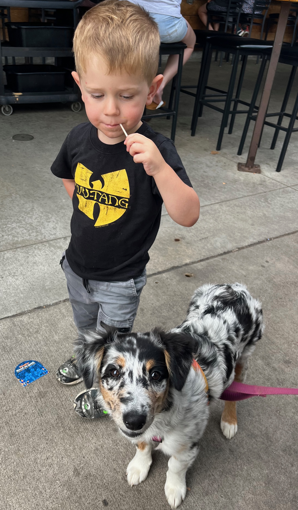

# Course introduction

## About me



My [personal "website"](https://github.com/bgreenwell)

---

## The software world has changed 🌍

::: {.incremental}
- AI code assistants (like [GitHub Copilot](https://github.com/features/copilot), [Claude Code](https://claude.ai/code), and [Gemini CLI](https://ai.google.dev/gemini-api/docs/get-started/tutorial?lang=rest#start-command-line)) are no longer a novelty; they're rapidly becoming a standard part of the professional developer's toolkit.
- Knowing how to use these tools effectively is becoming a required skill for new graduates.
- Our goal is to make you proficient not just in a language, but in this new AI-augmented workflow.
:::

---

## Our course philosophy 💭

::: {.incremental}
- This course directly addresses the valid concerns of using AI in education.
- We'll use AI to handle boilerplate and accelerate development, not to do our thinking for us.
- **You're the pilot! ✈️** You're responsible for every line of code, and you must understand, test, and be able to explain the code you submit.
- We'll critically examine where AI excels and where it fails, addressing issues like short-term memory, hallucinations, and repeatability.
:::

---

## What we'll learn 🎯

::: {.incremental}
- Write clean, professional [Python](https://www.python.org/) and [Rust](https://www.rust-lang.org/) code.
- Use [Git](https://git-scm.com/) and [GitHub](https://github.com/) for version control and collaboration.
- Leverage AI code assistants to write, debug, and refactor code.
- Build data-driven applications that interact with real-world APIs. 🌐
- Create a unique portfolio project that showcases your skills to future employers. 💼
:::

---

## Our roadmap 🗺️

::: {.incremental}
- **Foundations & modern tooling** ([Git](https://git-scm.com/), [GitHub](https://github.com/), AI assistants) (weeks 1-2)
- **[Python](https://www.python.org/) fundamentals with an AI partner** (from basics to OOP) (weeks 3-6)
- **Building a Python application** (APIs and the midterm project) (weeks 7-9)
- **New frontiers: [Rust](https://www.rust-lang.org/)** (performance, safety, and a new ecosystem) (weeks 10-12)
- **Synthesis & the final project** (your portfolio piece) (weeks 13-14)
:::

---

## Key course components 📊

::: {.incremental}
- Our grading is designed to reflect hands-on, applied skill.
- Labs: 70%
- Midterm (group) project: 15%
- Final (group) project: 15%
- Our primary communication channel will be our associated class channel in [Microsoft Teams](https://teams.microsoft.com/).
:::

---

## Important course links 🔗

::: {.incremental}
- **Course Canvas:** [uc.instructure.com](https://uc.instructure.com/courses/1812798) (grades, slides, labs, due dates, etc.)
- **Course repository:** [GitHub template](https://github.com/bgreenwell/is4010-course) (labs and projects)
- **Course syllabus:** [Online syllabus](https://bgreenwell.github.io/is4010-instructor-materials/syllabus.html) (always up-to-date)
- **Communication:** [Microsoft Teams](https://teams.microsoft.com/l/team/19%3ASjdonOkpgQOXFJf6qmHIWfJIwzgKl-xvmnkNVUkg8k81%40thread.tacv2/conversations?groupId=5c3ca09e-ec41-473c-8395-ab28de92a041&tenantId=f5222e6c-5fc6-48eb-8f03-73db18203b63) (primary discussion, questions about the material, questions about the labs, etc.)
:::

---

## The final project: Your portfolio piece 🎨

::: {.incremental}
- The culmination of this course is a student-choice final project.
- You get to propose and build an application you're passionate about.
- The only major requirement is that it must meaningfully use Python, Rust, and our AI-driven workflow.
- This is your chance to create something unique that you can proudly showcase.
:::

---

## Setup fest 🛠️

- Time to get our hands dirty.
- We'll now spend the rest of the session setting up our development environment.
- **Checklist:** (follow the detailed [Setup Guide](https://github.com/bgreenwell/is4010-course/blob/main/resources/SETUP_GUIDE.md)!!)
    - Install [Visual Studio Code](https://code.visualstudio.com/)
    - Install [Python 3.10+](https://www.python.org/downloads/)
    - Install [Git](https://git-scm.com/downloads)
    - Install the [Rust toolchain](https://rustup.rs/)
    - Install [Gemini CLI](https://github.com/google-gemini/gemini-cli?tab=readme-ov-file#quick-install) (optional)
---

## How to know it's working ✅

- Open your terminal or command prompt and run the following commands:
  - [`git --version`](https://git-scm.com/)
  - [`python --version`](https://www.python.org/) (or `python3 --version`)
  - [`cargo --version`](https://rustup.rs/)
  - [`gemini --version`](https://rustup.rs/)
- In VS Code, check for the GitHub Copilot icon in the bottom status bar.
- We'll walk through this together.

---

## For next time 📅

::: {.incremental}
- Please ensure you've finished the complete setup before our next class.
- Create your [GitHub account](https://github.com/join) if you haven't already.
- **Next session:** we'll dive deep into Git and GitHub, the foundation of collaborative software development.
:::

---

# Version control with Git & GitHub 📝

---

## What is version control? ⏰

::: {.incremental}
- Think of it as a [time machine for your code](https://github.com/bgreenwell/timewarp/tree/main).
- It tracks every single change you make to a project over time.
- It lets you rewind to a previous version if you make a mistake or need to see an older state of the code.
- It's the absolute foundation for collaborating with other developers on a shared project.
:::

---

## A brief history of version control 📚

::: {.incremental}
- **Early days (1970s-90s):** [RCS](https://www.gnu.org/software/rcs/), [SCCS](https://en.wikipedia.org/wiki/Source_Code_Control_System) - single files, no networking
- **Centralized era (2000s):** [Subversion (SVN)](https://subversion.apache.org/), [CVS](https://www.nongnu.org/cvs/) - single server, everyone syncs to it
- **Distributed revolution (2005):** Git was created by [Linus Torvalds](https://www.reddit.com/r/linux/comments/vbvxiv/10_years_ago_today_linus_torvalds_to_nvidia_fu_you/?utm_source=share&utm_medium=web3x&utm_name=web3xcss&utm_term=1&utm_content=share_button) for Linux kernel development
  - Born out of frustration with existing tools for Linux development
  - Designed for speed, data integrity, and distributed workflows
- **Modern landscape:** Git dominates (~90% market share), with hosting platforms competing on features
:::

::: {.notes}
**TEACHING NOTES:**

- **RCS/SCCS context:** These were for individual developers - imagine saving "essay_v1.docx", "essay_v2.docx" but automated
- **Centralized problems:** If the SVN server went down, nobody could save their work! All collaboration stopped
- **Enter Linus Torvalds:** Built Git in just 2 weeks after [BitKeeper](https://en.wikipedia.org/wiki/BitKeeper) (previous tool) revoked free access. The link shows his famous "F you NVIDIA" moment - he's known for strong opinions!
- **Why it matters:** Understanding this history explains why Git feels complex - it was built by kernel developers for kernel developers
- **Modern dominance:** Even Microsoft moved from their own TFS to Git - that's when you know a technology won
:::

---

## Version control systems 📊 {.smaller}

**Centralized vs. Distributed:**

| **Centralized ([SVN](https://subversion.apache.org/), [CVS](https://www.nongnu.org/cvs/))** | **Distributed ([Git](https://git-scm.com/), [Mercurial](https://www.mercurial-scm.org/))** |
|--------------------------|--------------------------------|
| Single source of truth | Every copy is complete |
| Must be online to commit | Work offline, sync later |
| Simpler mental model | More flexible workflows |
| Single point of failure | Redundant by design |

::: {.incremental}
- **Why Git won:** Speed, branching, offline capability, and Linux adoption
:::

---

## Git hosting platforms 🏠 {.smaller}

| Platform | Strengths | Best For |
|----------|-----------|----------|
| **[GitHub](https://github.com/)** | Largest community, excellent discoverability | Open source, portfolio projects |
| **[GitLab](https://gitlab.com/)** | Integrated CI/CD, self-hosting | Enterprise, DevOps workflows |
| **[Bitbucket](https://bitbucket.org/)** | Atlassian integration ([Jira](https://www.atlassian.com/software/jira), [Confluence](https://www.atlassian.com/software/confluence)) | Teams using Atlassian tools |
| **[Azure DevOps](https://azure.microsoft.com/en-us/products/devops)** | Microsoft ecosystem integration | .NET development, enterprise |

::: {.incremental}
- All use Git under the hood - the collaboration features differ
- **For this course:** We'll use GitHub for its student-friendly features and industry relevance
:::

---

## Git 🆚 GitHub

::: {.incremental}
- This is a common point of confusion.
- **[Git](https://git-scm.com/):** is the software tool that runs on your computer. It does the actual work of tracking changes. (Think of it like Microsoft Word.)
- **[GitHub](https://github.com/):** is a website that stores your Git projects in the cloud. It's where you share your code and collaborate. (Think of it like OneDrive or Google Docs.)
:::

---

## The core workflow 🔄

::: {.incremental}
- **Remote (GitHub):** a project lives on GitHub.
- **`git clone`:** you download a perfect copy to your local machine.
- **Local (your computer):** you edit files, write code, and fix bugs.
- **`git add` & `git commit`:** you save a snapshot (a commit) of your changes to your local history.
- **`git push`:** you upload your new commits from your computer back to GitHub.
:::

---

## Key terminology 📖

::: {.incremental}
- **Repository (repo):** a folder that contains your project and its entire history.
- **Commit:** a snapshot of your files at a specific point in time; a saved checkpoint.
- **Staging area:** a temporary holding place where you gather the changes you want to include in your next commit.
- **Push:** the command to send your committed changes from your local computer to GitHub.
:::

---

## Essential Git commands 🛠️

::: {.incremental}
- **`git clone <url>`** - Download a repository from GitHub to your computer
- **`git status`** - See what files have changed and what's ready to commit
- **`git add <file>`** - Stage specific files for your next commit
- **`git add .`** - Stage ALL changed files for your next commit
- **`git commit -m "message"`** - Save your staged changes with a descriptive message
- **`git push`** - Send your commits from local to remote
:::

---

## The Git workflow in action 💻

Here's what the commands actually look like:

```bash
# Check what's changed
$ git status
On branch main
Changes not staged for commit:
  modified:   hello.py

# Stage your changes
$ git add hello.py

# Commit with a message
$ git commit -m "Fix greeting message"
[main 1a2b3c4] Fix greeting message
 1 file changed, 1 insertion(+), 1 deletion(-)

# Push to GitHub
$ git push origin main
```

::: {.notes}
**LIVE DEMO NOTES:**
- Open terminal and navigate to a demo repository
- Modify a file (edit hello.py to change the message)
- Run each command and explain the output
- Show how `git status` changes after each step
- Demonstrate the GitHub page updating after push
- If time permits, show `git log` to see the commit history
:::

---

## Live demo time! 🎬

We'll create repositories two ways, then walk through the basic Git workflow:

::: {.incremental}
1. **Method 1: GitHub first** - Create repo on GitHub → `git clone`
2. **Method 2: Local first** - Create local repo → connect to GitHub
3. **Add & push code** - Create Python file, commit, and push
4. **Demonstrate `git pull`** - Edit on GitHub, then pull changes locally
:::

::: {.notes}
**DEMO STEPS:**

**Method 1 (GitHub first):**
- Create new repo on GitHub: "demo-github-first"
- Clone: `git clone https://github.com/bgreenwell/demo-github-first.git`

**Method 2 (Local first):**
- Create folder: `mkdir demo-local-first && cd demo-local-first`
- Initialize: `git init`
- Create GitHub repo, add remote: `git remote add origin https://github.com/bgreenwell/demo-local-first.git`
- Push: `git push -u origin main`

**Add code to GitHub-first repo only:**
- Add hello.py: `print("Hello from GitHub first!")`
- Show workflow: `git status` → `git add .` → `git commit -m "Add hello script"` → `git push`

**Demonstrate git pull:**
- Edit hello.py directly on GitHub (add a comment or change message)
- Back in terminal: `git pull` to fetch the changes
- Show how local file now matches GitHub version

**Key points to emphasize:**
- Both creation methods achieve same result
- GitHub-first is easier for beginners
- `git pull` keeps you synced with remote changes
- This is the complete collaboration cycle
:::

---

## More useful Git commands 📚

::: {.incremental}
- **`git log`** - See the history of your commits
- **`git log --oneline`** - Compact view of commit history
- **`git diff`** - See exactly what changed in your files
- **`git pull`** - Download the latest changes from GitHub
- **[`git init`](https://git-scm.com/docs/git-init)** - Turn any folder into a Git repository
:::

---

## Understanding Git's three stages 🔄

```{mermaid}
%%| echo: false
graph LR
    A[Working Directory<br/>Your files] --> B[Staging Area<br/>git add]
    B --> C[Repository<br/>git commit]
    C --> D[Remote GitHub<br/>git push]
    
    style A fill:#ffcccb
    style B fill:#ffffcc  
    style C fill:#ccffcc
    style D fill:#ccccff
```

::: {.incremental}
- **Working Directory:** where you edit files
- **Staging Area:** where you prepare what to commit
- **Repository:** your local Git history
- **Remote:** your project on GitHub
:::

---

## Common Git scenarios & fixes 🚑

::: {.incremental}
- **"I made a typo in my commit message"**
  - `git commit --amend -m "New message"`
- **"I want to see what I changed"**
  - `git diff` (before staging) or `git diff --staged` (after staging)
- **"I staged the wrong file"**
  - `git reset HEAD <file>` to unstage
- **"Authentication failed"**
  - Make sure you're using your [PAT](https://docs.github.com/en/authentication/keeping-your-account-and-data-secure/managing-your-personal-access-tokens), not your GitHub password
:::

---

## Want to learn more? 📚

Essential resources for mastering Git and GitHub:

::: {.incremental}
- **[Pro Git Book](https://git-scm.com/book/en/v2)** - The definitive free guide (chapters 1-3 are perfect for beginners)
- **[GitHub Skills](https://skills.github.com/)** - Interactive tutorials directly on GitHub
- **[Learn Git Branching](https://learngitbranching.js.org/)** - Visual, interactive Git concepts
- **[GitHub Desktop](https://desktop.github.com/)** - GUI alternative for those who prefer visual tools
- **[Atlassian Git Tutorials](https://www.atlassian.com/git/tutorials)** - Comprehensive beginner to advanced guides
:::

---

## Quick reference cheat sheet 📋

Commands you'll use constantly:

```bash
# Getting started
git clone <url>         # Download a repository
git status              # See what's changed
git log --oneline       # View commit history

# Making changes  
git add <file>          # Stage specific file
git add .               # Stage all changes
git commit -m "message" # Save your changes
git push                # Send to GitHub

# Fixing mistakes
git diff                # See what changed
git reset HEAD <file>   # Unstage a file
git commit --amend      # Fix last commit message
```

---

## Time for Lab 01 🧪

- Your first hands-on lab: Git and GitHub fundamentals.
- **Objective:** complete your first full development cycle from `clone` to `push`.
- Please navigate to [`week01/lab01.md`](https://github.com/bgreenwell/is4010-course/blob/main/week01/lab01.md) in the course repository for step-by-step instructions.
